# Tutorial Opensim MOCO integrado a uma IDE Python

## Instalando o Opensim

Entre na sua conta do OpenSim e faça o download do [OpenSim 4.5](https://simtk.org/frs/?group_id=91).

Instale o programa na pasta sugerida. Caso instale em outro local, certifique-se de saber o caminho do arquivo, por exemplo `C:\User\OpenSim 4.5`.

## Instalando o Anaconda

Utilizando seu e-mail de preferência, faça o login e baixe o [Anaconda](https://www.anaconda.com/download)

Durante a instalação, certifique-se de instalar o programa para todos os usuários (requer privilégios de administrador), de registrar o Anaconda3 as the system Python 3.1X e de criar atalhos de menu de iniciar, conforme indicado nas figuras abaixo.

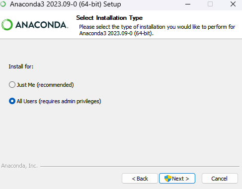

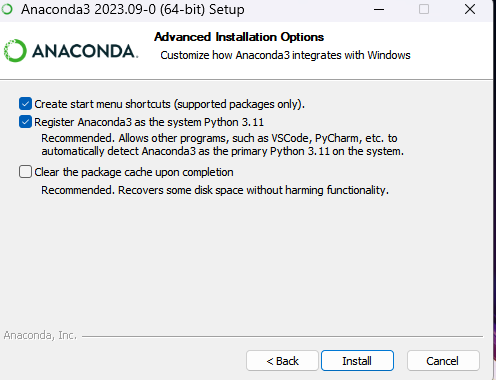

#### **ATENÇÃO: Para evitar problemas de path, instale ambos OpenSim e Anaconda no mesmo disco!**

## Criando o ambiente Python com MOCO

1. Abra o Anaconda Prompt como Administrador

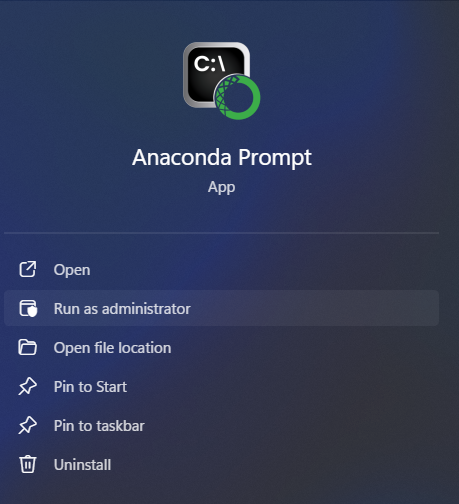

2. Atualize o conda com o seguinte comando (os privilégios de administrador serão necessários aqui):

        conda update -n base -c defaults conda

    Se tudo tiver sido feito corretamente, aparecerão as seguintes mensagens em todos os próximos passos:

        Preparing transaction: done

        Verifying transaction: done

        Executing transaction: done

3. Use os seguintes comandos para:

    3.1 Criar um novo ambiente Conda opensim_env:

        conda create -n opensim_env python=3.11 numpy

    3.2 Ativar o novo ambiente Conda:

        conda activate opensim_env

4. Dentro do novo ambiente, instale os pacotes do opensim executando: 

        conda install -c opensim-org opensim

    (Obs.: A partir do OpenSim 4.5.1, o OpenSim MOCO está incluso!)

    Nesse mesmo próprio prompt, teste se a instalação está correta, executanto:

        Python

        >> import opensim as osim

        >> osim.GetVersionAndDate()

        >> quit()


    Note que, ao entrar no ambiente Python, aparecerá o marcador ">>". Apenas digite as linhas de código quando o marcador estiver aparecendo na sua tela.

    Se a instalação tiver sido feita corretamente, uma mensagem como a abaixo aparecerá:

    <aside>

    > *>>> osim.GetVersionAndDate()*

    > 'version 4.5.1, build date 09:40:37 Jul 26 2024’

    </aside>

5. Por fim, instale as seguintes bibliotecas

    5.1 Matplotlib, para gráficos

        conda install matplotlib
    
    5.2 Pandas, para manipulação de dados

        conda install pandas

    5.3 YAML, para arquivos de configuração

        conda install pyyaml

    5.4 Scikit, para sinergias

        conda install anaconda::scikit-learn


## Instalando o VS Code

Faça o download e instale o [Visual Studio Code](https://code.visualstudio.com/docs/setup/windows)

Baixado o VS Code, abra-o e clique na aba de Extensões na barra lateral esquerda.
Pesquise por "Python" e instale a extensão desenvolvida pela Microsoft.

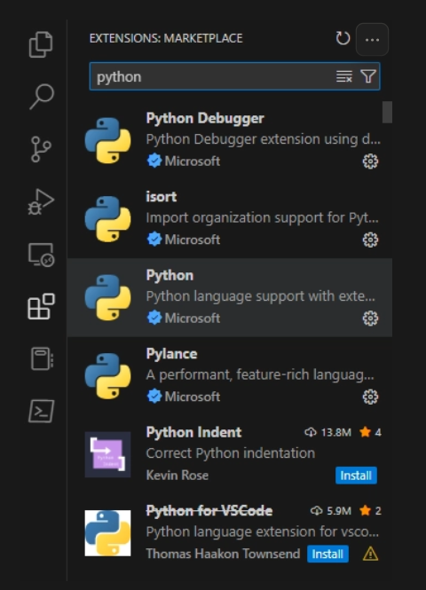

Em seguida, abra uma nova pasta vazia para guardar um projeto teste e, ainda nela, crie um arquivo chamado `main.py`.

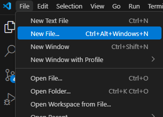

Nesse arquivo `main.py`, coloque o seguinte script:

```
import opensim as osim
print(osim.GetVersionAndDate())
quit()
```

Após editar o `main.py`, pressione o atalho _**ctrl+shift+p**_ para abrir a paleta de comandos, busque por `"Python: Select interpreter"` e escolha o ambiente conda previamente criado.

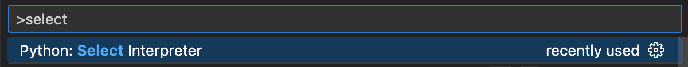

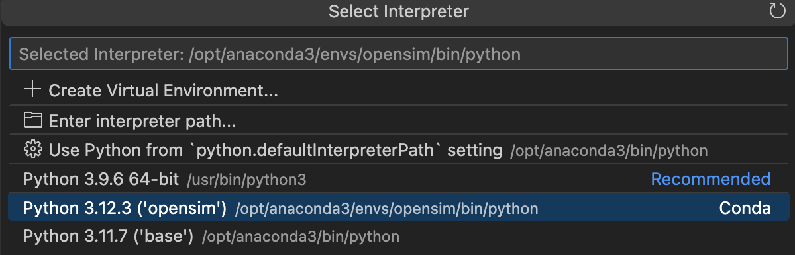

Abrindo novamente a paleta de comandos, digite `"Preferences: Open User Settings (JSON)"` e selecione-o. Na aba aberta, adicione as seguintes linhas e reinicie o VS Code:


```
"terminal.integrated.inheritEnv": false,
"python.terminal.executeInFileDir": true,
"terminal.integrated.defaultProfile.osx": "zsh",
"terminal.integrated.env.osx": { "PYTHONPATH": "${workspaceFolder}/:${workspaceFolder}/.."}
```
    

Certifique-se de acrescentar também uma vírgula ao final do script que já vem na aba, do contrário você receberá uma mensagem de erro de sintaxe. A aba deve ficar da seguinte forma após essas alterações:

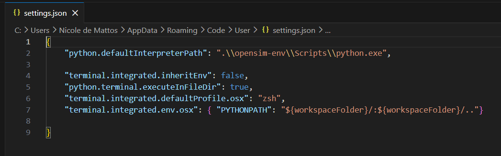

Reiniciado o VS Code, pressione o botão de play no canto superior direito da tela e rode o código `main.py`. Você deverá ver uma saída parecida com a seguinte:

    C:\ProgramData\anaconda3\python.exe C:\Users\anacs\PycharmProjects\pythonProject\main.py 
    version 4.4.1-2023-07-13-710e13be5, build date 09:37:16 Jul 14 2023

    Process finished with exit code 0


## Possíveis mensagens de erro

#### 1. Termo conda não reconhecido
    
Após completar todos os passos acima, é possível que ocorra, ao tentar compilar algum código, a seguinte mensagem de erro de caminho:

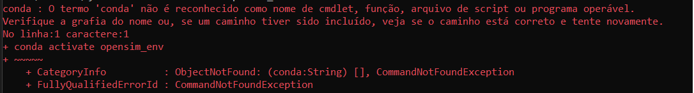

Para corrigí-lo, digite no Windows “variáveis de Ambiente” e selecione “Editar variáveis
de ambiente do sistema”.

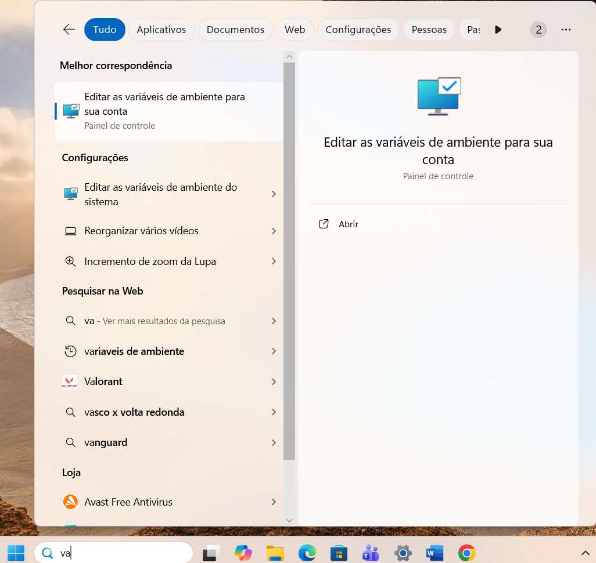

Em seguida, em “Variáveis do usuário”, selecione “Path” e clique em “Editar...”.

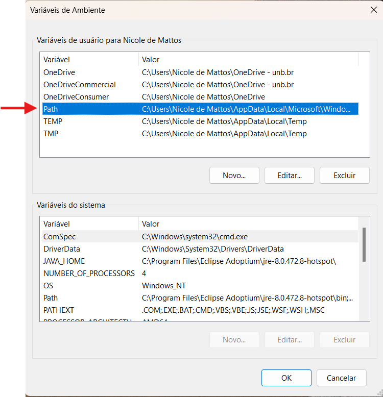

Clique em “Novo” e adicione os três caminhos indicados na imagem abaixo. Por fim,
clique nos dois “Ok” (um em cada janela) e reinicie o computador.

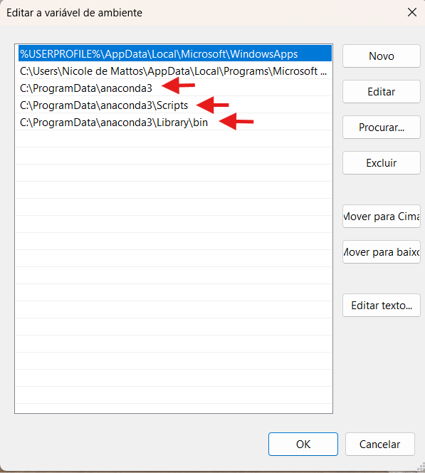


#### 2. Acesso não autorizado

Também é possível que ocorra um erro devido a política de execução do PowerShell,
que impede o carregamento de scripts para proteção do sistema (PSSecurityException). 

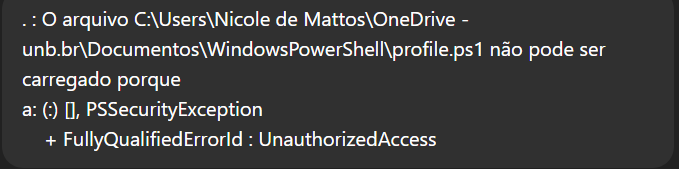

Para corrigí-lo, digite no Windows “PoweShell”, clique com o botão direito e selecione
“Executar como administrador”.

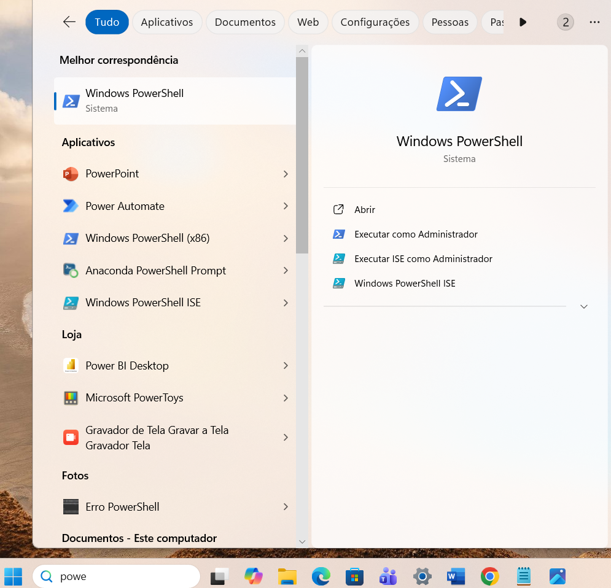

Digite “Get-ExecutionPolicy” e dê enter. Aparecendo a mensagem “Restricted”, digite “Set-ExecutionPolicy RemoteSigned” e enter novamente. Por fim, digite S (ou Y) e pressione enter. O prompt deve ficar da seguinte forma:

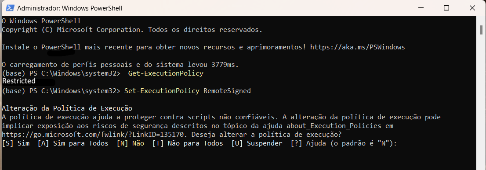

Essa nova configuração permite a execução de scripts criados pelo usuário.


## Simulando o código PID Cycling

Para fazer a simulação do código PID Cycling abra no VS Code um novo workspace e adicione a pasta `Código PID.zip` anexada a este tutorial.

Ao rodar o código, ele criará automaticamente um arquivo `.sto` na pasta `Results/pid`. Abrindo esse arquivo no Opensim permitirá ver a simulação gerada pelo código. 

Também deve ser obtido o seguinte gráfico no próprio VS Code:

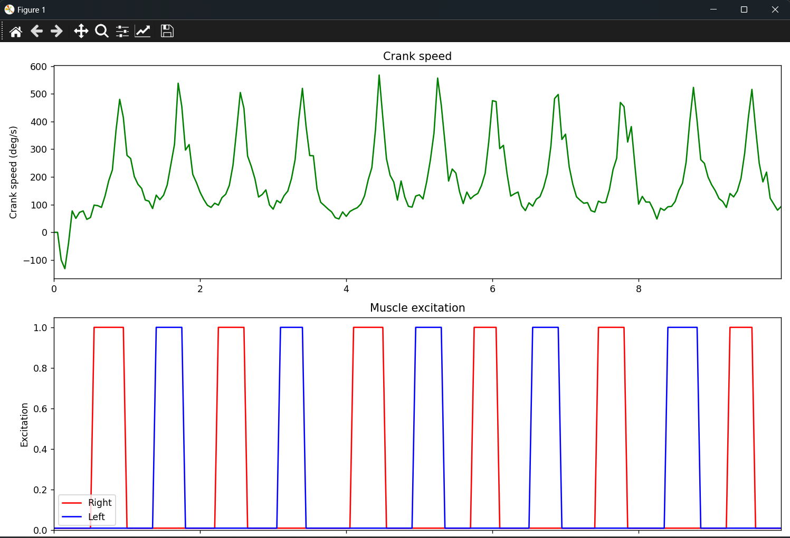
